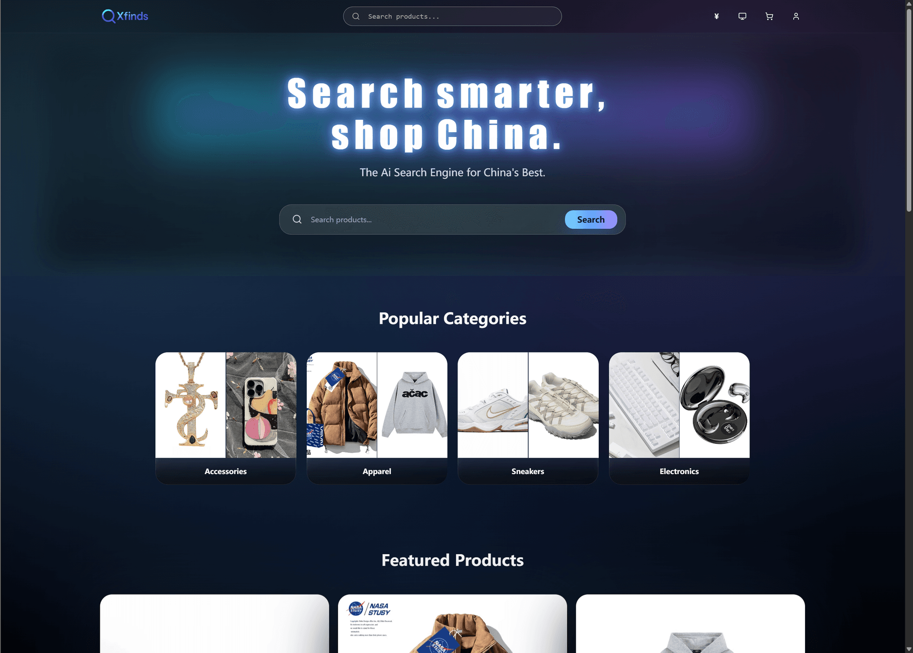
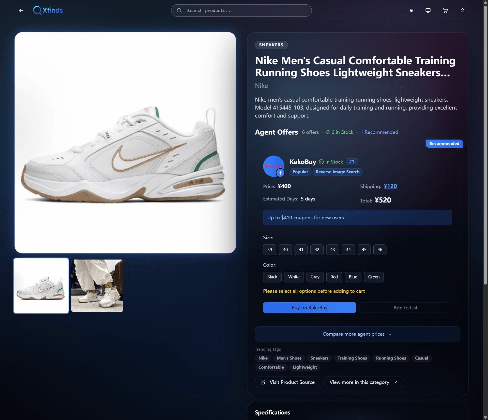
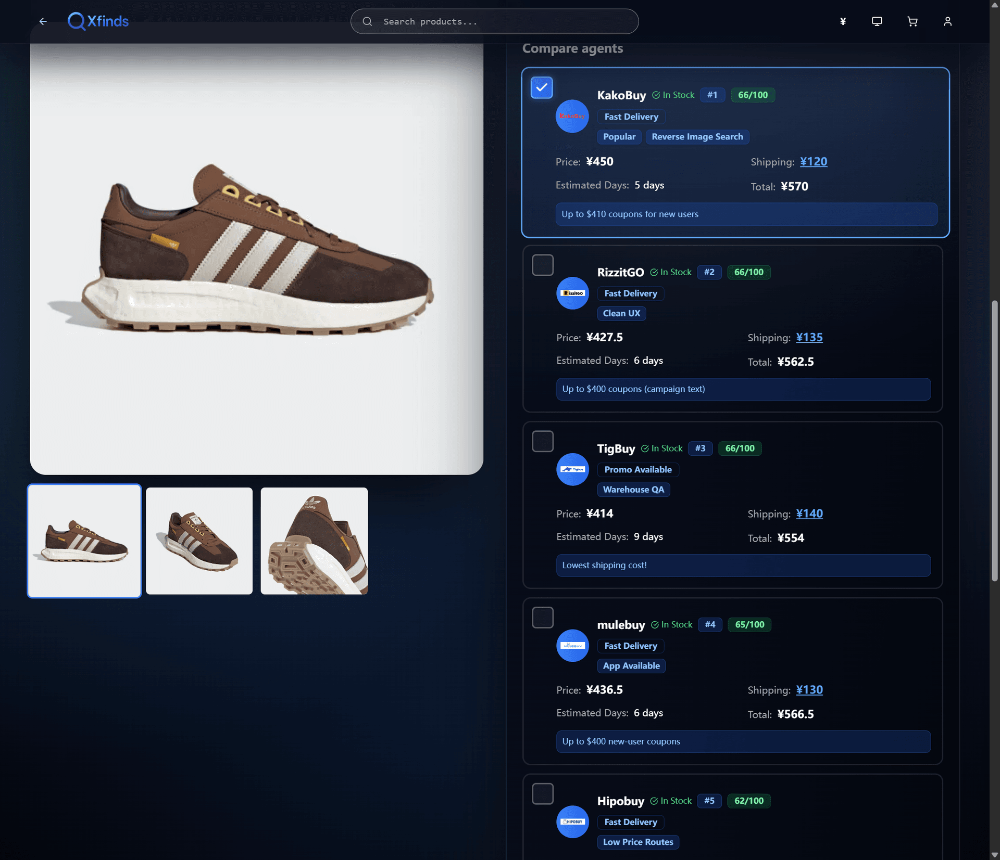
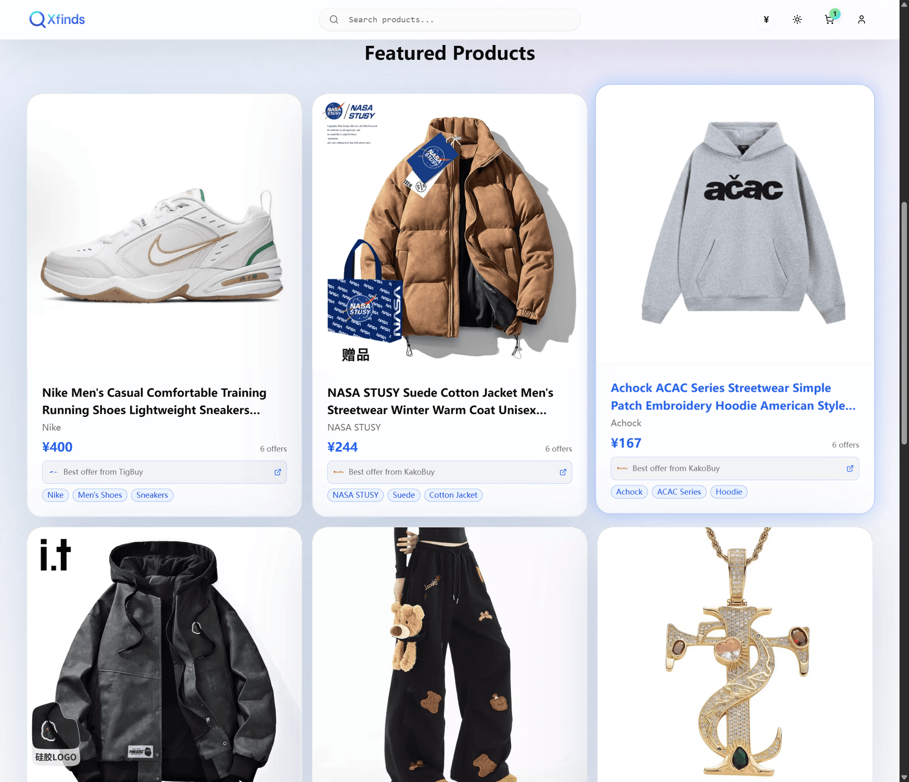

<div align="center">

<!-- Use repository-relative paths (GitHub renders these reliably, even on private repos) -->


# Xfinds

### Open-source agent search and comparison for faster, clearer buying decisions.

Modern product search and agent comparison with a fast glassmorphic UI. Built for engineers who want a transparent, extensible, self-hostable marketplace experience.

[](https://nextjs.org/)
[](https://www.typescriptlang.org/)
[](https://tailwindcss.com/)
[](LICENSE)

<a href="https://xfinds.cc"><b>Live Demo</b></a> · <a href="docs/ARCHITECTURE.md"><b>Architecture</b></a> · <a href="https://github.com/TheNewMikeMusic/Xfinds/issues"><b>Issues</b></a> · <a href="CONTRIBUTING.md"><b>Contribute</b></a>

<br />
<!-- Homepage hero -->


</div>

---

## Why Xfinds
- Search once and see every agent offer in one view.
- Transparent pricing with side-by-side comparison and live currency conversion.
- Built for speed: glass UI, smooth motion, tuned for fast interactions.
- Global ready: English and Chinese today; add locales easily.
- Open-source first: MIT licensed, API-friendly, and simple to self-host.

## Feature Highlights
- Smart fuzzy search (Fuse.js) with category, price, and agent filters.
- Agent comparison to judge price versus service quality.
- Saved picks and batch-open flows for checkout readiness.
- Locale-prefixed routes with edge-safe i18n middleware.
- Tailwind + shadcn/ui + Framer Motion for crisp, responsive UX.
- API routes for products, agents, uploads, and revalidation.

## Trust Signals (open-source matters)
- MIT license; no lock-in.
- Typed codebase (TypeScript) with clear architecture docs.
- Security headers and edge-safe middleware enabled by default.
- Testing setup ready: Vitest and Playwright configs included.

## Screenshots
<div align="center">
  <!-- Homepage hero -->
  
  <br /><br />
  <!-- Product detail -->
  
  <br /><br />
  <!-- Agent comparison -->
  
  <br /><br />
  <!-- Featured products grid -->
  
</div>

## Quick Start
```bash
# Clone
git clone https://github.com/TheNewMikeMusic/Xfinds.git
cd Xfinds

# Install
npm install

# Env
cp .env.example .env.local

# Dev server
npm run dev
# open http://localhost:3000
```

### Production build
```bash
npm run build
npm run start   # defaults to http://localhost:8000
```

## Architecture at a glance
- app/ : Next.js App Router (locale-prefixed routes and API)
- components/ : UI and shared components
- hooks/ : Reusable hooks
- store/ : Zustand stores
- lib/ : Utilities (i18n, helpers)
- messages/ : Translations
- assets/ : Static assets and screenshots
- scripts/ : Build and image utilities
- docs/ : Architecture, deployment, guides

## Tech Stack
| Area | Tech |
| --- | --- |
| Framework | Next.js 14 (App Router) |
| Language | TypeScript |
| UI | Tailwind CSS, shadcn/ui, Framer Motion |
| State | Zustand |
| Search | Fuse.js |
| Auth/Crypto | jose, bcryptjs |
| Testing | Vitest, Playwright |

## Documentation and Links
- [Architecture](docs/ARCHITECTURE.md)
- [Deployment](docs/DEPLOYMENT.md)
- [Contributing](CONTRIBUTING.md)
- [Changelog](CHANGELOG.md)

## Community
- Issues and ideas: use GitHub Issues to report and propose.
- Pull requests: start with a small PR; follow the Contributing guide.
- Roadmap: see milestones and changelog for what is coming next.

## License
MIT (c) Xfinds
